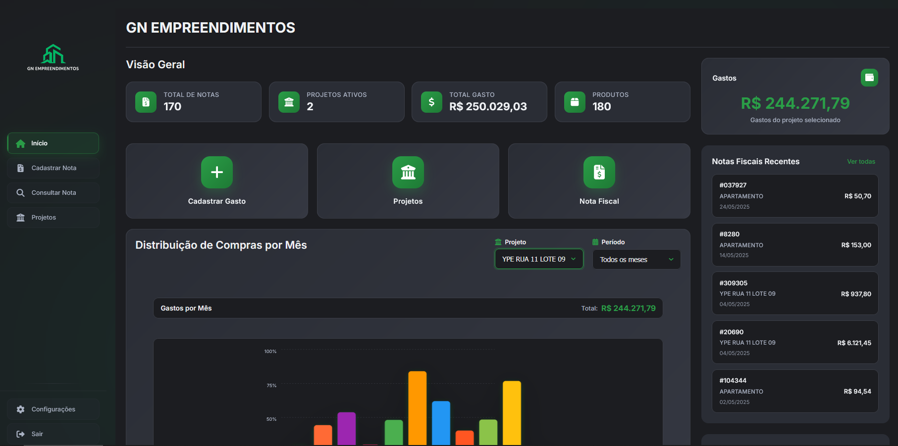
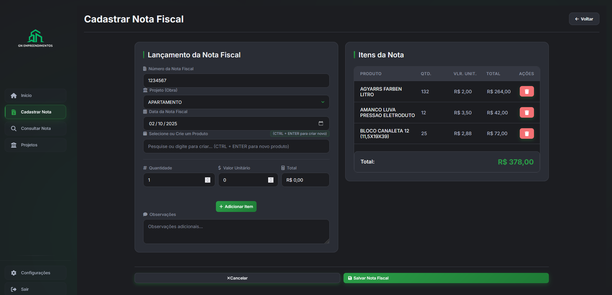
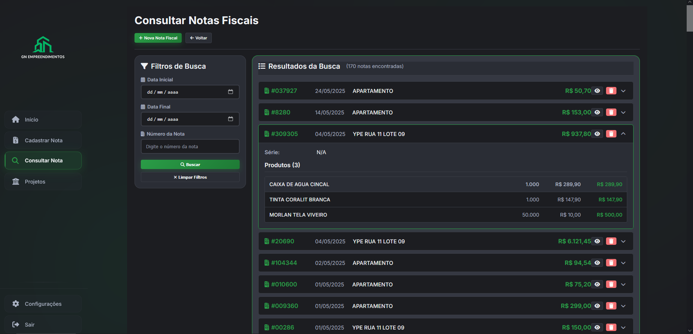
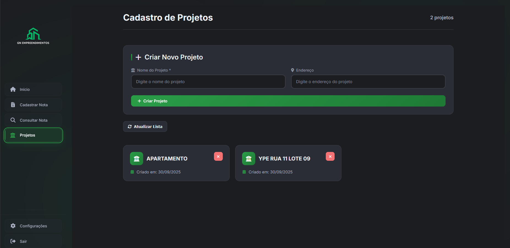
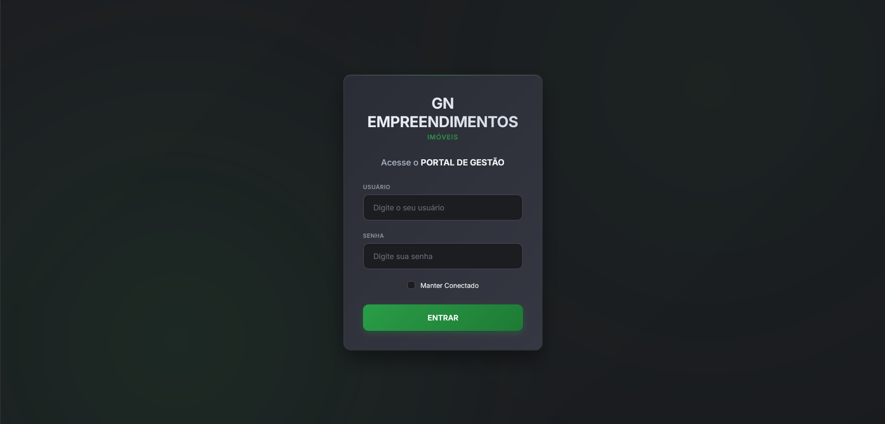

#  Sistema de Gestão de Obras

Sistema completo de gestão de obras com frontend React e backend Node.js, oferecendo uma solução robusta para gerenciar projetos, produtos, notas fiscais e muito mais.

## Screenshots do Sistema

<div align="center">

### Dashboard Principal


### Gestão de Projetos


### Gestão de Produtos


### Notas Fiscais


### Interface Responsiva


</div>

## Tecnologias

- **Frontend**: React 18, TypeScript, CSS3
- **Backend**: Node.js, Express, TypeScript, Sequelize
- **Banco de Dados**: PostgreSQL

## Principais Funcionalidades

- **Dashboard** com estatísticas e gráficos em tempo real
- **Gestão de Projetos** (CRUD completo)
- **Gestão de Produtos** (CRUD completo)
- **Gestão de Notas Fiscais** (CRUD completo)
- **Busca e Filtros** avançados
- **Autenticação JWT** segura
- **Interface Responsiva** para dispositivos móveis
- **Documentação Completa** com Docusaurus

## Instalação Rápida

### 1. Clone o repositório
```bash
git clone https://github.com/brunocardsx/sys-Obras.git
cd sys-Obras
```

### 2. Instale todas as dependências
```bash
npm run install:all
```

### 3. Configure o banco de dados
```sql
CREATE DATABASE sysobras;
CREATE USER postgres WITH PASSWORD 'admin';
GRANT ALL PRIVILEGES ON DATABASE sysobras TO postgres;
```

### 4. Configure as variáveis de ambiente

#### Backend (.env)
```env
DB_HOST=localhost
DB_PORT=5432
DB_NAME=sysobras
DB_USER=postgres
DB_PASS=admin
JWT_SECRET=sua-chave
ADMIN_USER=admin
ADMIN_PASS=admin123
PORT=8081
```

#### Frontend (.env)
```env
REACT_APP_API_URL=http://localhost:8081
```

### 5. Execute o projeto
```bash
# Desenvolvimento (frontend + backend)
npm run dev

## Documentação

Este projeto inclui uma documentação completa criada com **Docusaurus**!

### Executar a documentação
```bash
# Desenvolvimento
npm run docs:dev

# Build para produção
npm run docs:build

# Servir documentação compilada
npm run docs:serve
```

A documentação estará disponível em: `http://localhost:3000`

### O que você encontrará na documentação:
- Guia completo de instalação
- Tutoriais passo a passo
- Documentação da API
- Exemplos de uso
- Guias de deploy
- Blog com atualizações

## Estrutura do Projeto

```
├── frontend/          # Aplicação React
├── backend/           # API Node.js
├── documentation/     # Documentação Docusaurus
├── assets/            # Screenshots e imagens
├── .gitignore         # Arquivos ignorados pelo Git
├── package.json       # Scripts principais
└── README.md          # Este arquivo
```


### Documentação
- `npm run docs:dev` - Executa documentação em desenvolvimento
- `npm run docs:build` - Compila documentação para produção
- `npm run docs:serve` - Serve documentação compilada

## Acessando a Aplicação

Após a instalação:
- **Frontend**: http://localhost:3000
- **Backend API**: http://localhost:8081
- **Documentação**: http://localhost:3000 (quando executar `npm run docs:dev`)

### Credenciais Padrão
- **Usuário**: admin
- **Senha**: admin123

## Arquitetura

### Backend (Node.js + TypeScript)
```
backend/src/
├── controllers/    # Controladores da API
├── models/         # Modelos do banco (Sequelize)
├── routes/         # Rotas da API
├── middleware/     # Middlewares (auth, validation)
├── services/       # Serviços (database)
├── utils/          # Utilitários (logger, response)
└── types/          # Tipos TypeScript
```

### Frontend (React + TypeScript)
```
frontend/src/
├── components/     # Componentes reutilizáveis
├── pages/          # Páginas da aplicação
├── services/       # Serviços de API
├── types/          # Tipos TypeScript
├── utils/          # Utilitários
└── hooks/          # Hooks customizados
```

## Desenvolvimento

### Pré-requisitos
- Node.js 18+
- npm 8+
- PostgreSQL 12+
- Git

### Configuração do Ambiente
1. Clone o repositório
2. Execute `npm run install:all`
3. Configure as variáveis de ambiente
4. Execute `npm run dev`

### Contribuindo
1. Fork o projeto
2. Crie uma branch para sua feature (`git checkout -b feature/AmazingFeature`)
3. Commit suas mudanças (`git commit -m 'Add some AmazingFeature'`)
4. Push para a branch (`git push origin feature/AmazingFeature`)
5. Abra um Pull Request


## Funcionalidades Detalhadas

### Dashboard
- Estatísticas em tempo real
- Gráficos interativos
- Resumo de projetos e produtos
- Indicadores de performance

### Gestão de Projetos
- CRUD completo de projetos
- Status de progresso
- Associação com produtos
- Controle de datas e orçamento

### Gestão de Produtos
- Catálogo completo
- Controle de estoque
- Categorização
- Histórico de preços

### Notas Fiscais
- Upload e processamento
- Vinculação automática com projetos
- Controle de itens
- Relatórios fiscais

## Próximas Funcionalidades

- [ ] Sistema de relatórios avançados
- [ ] Integração com APIs de pagamento
- [ ] Sistema de notificações
- [ ] Backup automático

## 📄 Licença

Este projeto está sob a licença MIT. Veja o arquivo [LICENSE](LICENSE) para mais detalhes.

## 👨‍💻 Autor

**Bruno Cardoso**
- GitHub: [@brunocardsx](https://github.com/brunocardsx)

---

<div align="center">

**⭐ Se este projeto te ajudou, considere dar uma estrela!**

[ Ver Documentação Completa](./documentation) | [ Reportar Bug](https://github.com/brunocardsx/sys-Obras/issues) | [ Sugerir Feature](https://github.com/brunocardsx/sys-Obras/issues)

</div>
